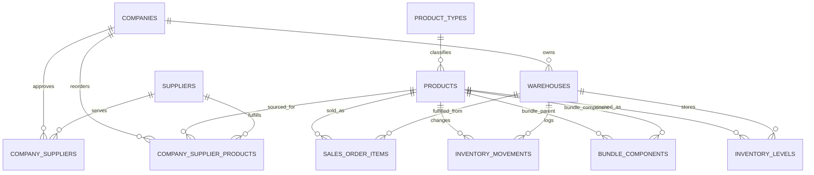
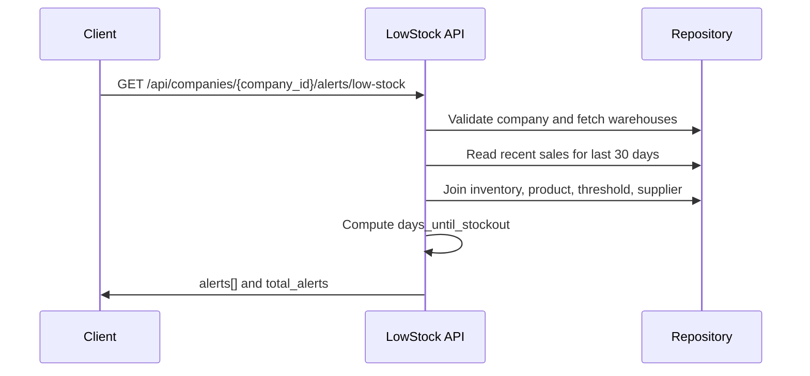
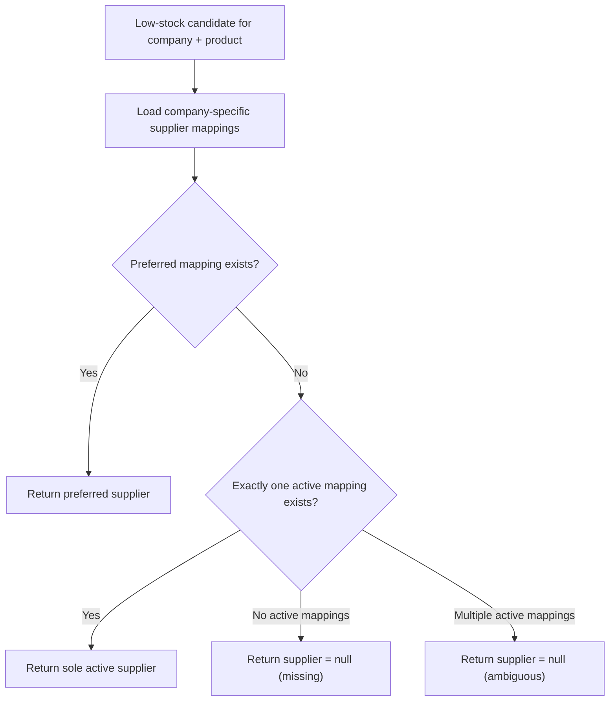
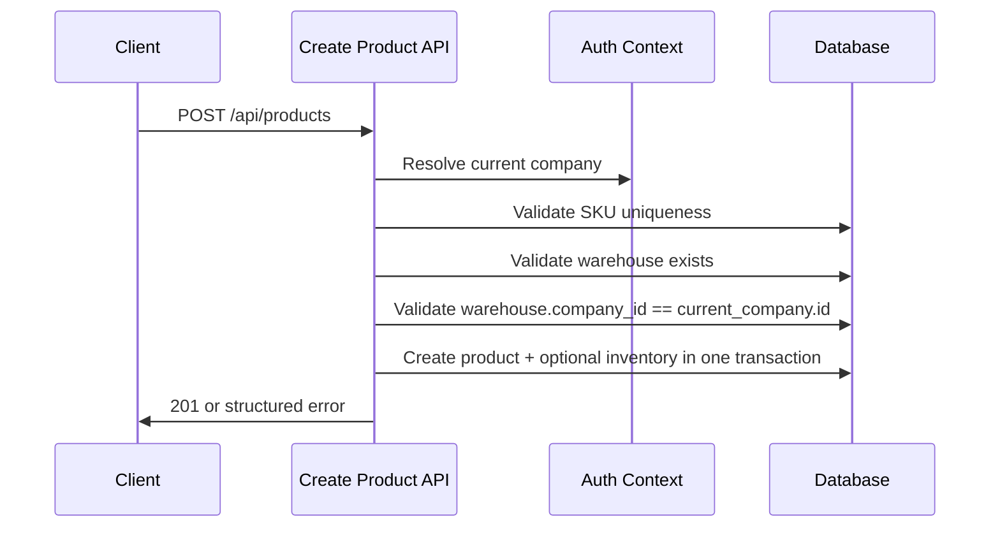
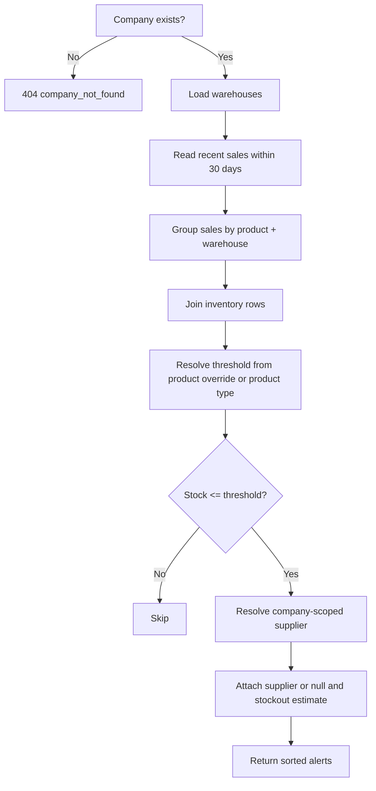

# Bynry Backend Engineering Case Study

This repository contains a structured submission for the Bynry backend engineering case study. The solution is organized by assessment part so each deliverable is easy to review independently.

## Repository Layout

- `Part 1/`
  - `code.py`: corrected product creation endpoint
  - `logic.md`: issue analysis, production impact, and fixes
- `Part 2/`
  - `schema.sql`: proposed database schema
  - `logic.md`: requirement gaps and design decisions
- `Part 3/`
  - `app.py`: runnable low-stock alerts API
  - `logic.md`: approach, edge cases, and assumptions
- `tests/`: API verification tests
- `requirements.txt`: Python dependencies

## Run Part 3

```powershell
cd "C:\Users\ADMIN\Desktop\Bynry - Case study submission"
python ".\Part 3\app.py"
```

API endpoint:

`GET /api/companies/{company_id}/alerts/low-stock`

Example:

[http://127.0.0.1:5000/api/companies/1/alerts/low-stock](http://127.0.0.1:5000/api/companies/1/alerts/low-stock)

## Run Tests

```powershell
cd "C:\Users\ADMIN\Desktop\Bynry - Case study submission"
pytest
```

## Diagrams

### Schema / Entity Relationship Map



### Low-Stock Alert Request Flow



### Supplier Resolution Flow



### Part 1 Ownership Validation Flow



### Evaluation Logic Map


